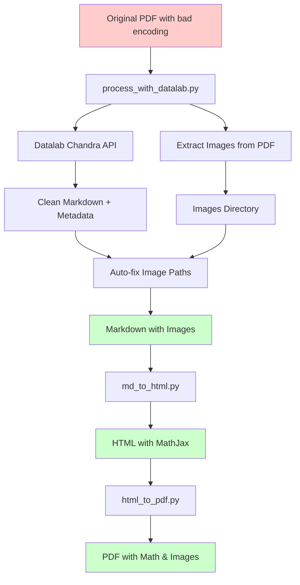

# Complete OCR Workflow

## Overview

This workflow converts Arabic PDFs with corrupted encoding into high-quality, searchable documents with proper math rendering and embedded images.

## The Flow



## Step-by-Step Process

### Step 1: Process PDF with Datalab API
```bash
python process_with_datalab.py pdfs/document.pdf output
```

**What happens:**
1. ✅ Extracts images from PDF using PyMuPDF → `output/document_images/`
2. ✅ Uploads PDF to Datalab Chandra API
3. ✅ Waits for OCR processing (polls every 2 seconds)
4. ✅ Downloads clean markdown with text
5. ✅ **Automatically fixes image paths** in markdown
6. ✅ Saves metadata JSON

**Outputs:**
- `output/document.md` - Clean markdown with fixed image paths
- `output/document_metadata.json` - Processing metadata
- `output/document_images/` - All extracted images

---

### Step 2: Convert to HTML (Auto-Cleaning & Styling)
```bash
python md_to_html.py output/document.md
```

**What happens:**
1. ✅ **Auto-Cleans LaTeX:**
   - Fixes mismatched `\left` and `\right` delimiters
   - Preserves `\rightarrow` (prevents "arrow" typos)
   - Removes unwanted image descriptions (e.g., "Graph showing...")
2. ✅ **Extracts Arabic Text:**
   - Detects Arabic inside math blocks (`\text{...}`)
   - Moves it outside to render correctly as RTL text
3. ✅ **Styling:**
   - Applies **'Amiri'** font (classic Arabic style)
   - Sets proper RTL direction
   - Adds MathJax for perfect equation rendering

**Output:**
- `output/document.html` - Styled HTML with math and images

---

### Step 3: Convert to PDF (High-Fidelity)
```bash
python html_to_pdf.py output/document.html
```

**What happens:**
1. ✅ Opens HTML in Chromium headless browser
2. ✅ Waits for MathJax to render equations (10 seconds)
3. ✅ Renders images
4. ✅ Exports to PDF with perfect formatting

**Output:**
- `output/document.pdf` - High-quality PDF with math and images

---

## Quick Commands

### Process Single PDF
```bash
# Full workflow
python process_with_datalab.py pdfs/document.pdf output
python md_to_html.py output/document.md
python html_to_pdf.py output/document.html
```

### Batch Process All PDFs
```bash
for pdf in pdfs/*.pdf; do
    basename=$(basename "$pdf" .pdf)
    python process_with_datalab.py "$pdf" output
    python md_to_html.py "output/${basename}.md"
    python html_to_pdf.py "output/${basename}.html"
done
```

---

## File Structure

```
antigrav-ocr/
├── pdfs/
│   └── document.pdf                    # Input PDF
├── output/
│   ├── document.md                     # Clean markdown (images auto-fixed)
│   ├── document.html                   # Styled HTML with MathJax
│   ├── document.pdf                    # Final PDF with math & images
│   ├── document_metadata.json          # API metadata
│   └── document_images/                # Extracted images
│       ├── page16_img1.jpeg
│       └── page17_img1.png
└── scripts/
    ├── process_with_datalab.py         # Main OCR processor
    ├── md_to_html.py                   # Markdown → HTML (Cleaner & Styler)
    └── html_to_pdf.py                  # HTML → PDF (Renderer)
```

---

## Key Features

| Feature | Status | How |
|---------|--------|-----|
| High-Quality OCR | ✅ | Datalab Chandra API |
| Arabic Text | ✅ | Native RTL support + 'Amiri' Font |
| Math Equations | ✅ | MathJax + Auto-Cleaning (Fixes LaTeX errors) |
| Images | ✅ | Auto-extracted & auto-embedded |
| No GPU Required | ✅ | Cloud-based API |
| Offline Processing | ❌ | Requires internet for API |

---

## Environment Setup

Required:
- Python 3.8+
- Datalab API key (in `.env` file)
- Chromium browser (for PDF generation)

```bash
# Install dependencies
pip install -r requirements.txt

# Set API key
echo "DATALAB_API_KEY=your_key_here" > .env
```
